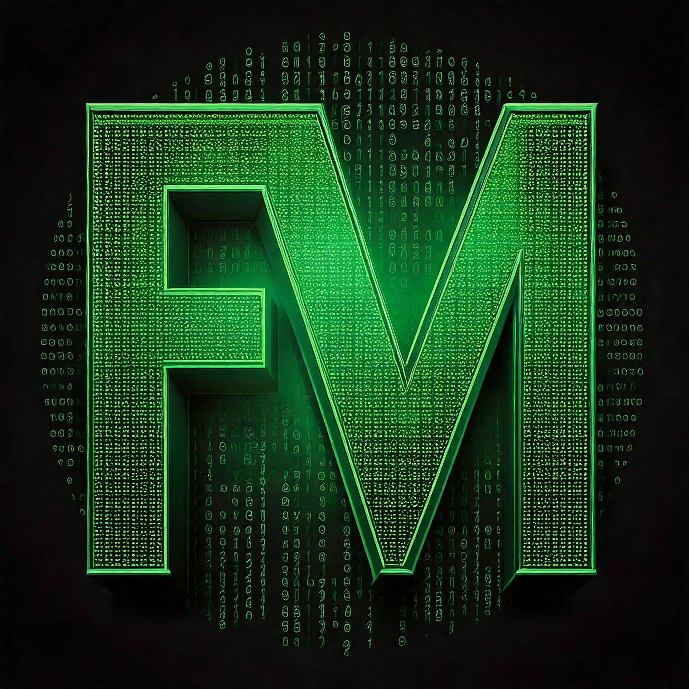

 <a href="https://fertmeneses.github.io/" target="_blank"> Go to Home Page </a> 

# Machine Learning and Quantum Diamond Magnetometry applied to Object Monitoring

My flagstaff project as a research fellow at The University of Melbourne combined **Machine Learning** architectures with experimental **Quantum Sensing** to solve a real-life problem: **monitor the position of an object using magnetic fields**. 

Magnetic sensing is a powerful technique that complements others like Global Positioning System (GPS) in the field of object monitoring. It is particularly interesting in application where GPS signals are denied, such as **indoors, underground or underwater**, because **magnetic signals can propagate in these environments**. Also, **magnetic tracking does not require that the target is equipped with a receiver**, which broadens the application scenarios for this technology.

The **major challenge for magnetic sensing**, however, comes with the **data analysis and interpretation**. Usually, magnetic information has a complex signature convoluted with the environmental noise, requiring sophiticated physical models and calculations that allow a precise interpretation to correlate the position of an object with its magnetic signal. **In this project**, we solve this problem by developing a **Machine Learning algorithm that learns to predict the position of an object based on magnetic measurements without the need of any physical models**.

'''Figure: Quantum Sensing + Machine Learning = Object monitoring'''

## Quantum Sensing Technology

Xxxx

'''Figure: Quantum Diamond Magnetometer'''

## Machine Learning Architecture

Xxxx

'''Figure: ML architecture'''

## Object Monitoring Application

Xxxx

'''Figure: Prediction results simplified'''

<figure>
   
  <figcaption>Conceptual image, AI-generated using the prompt: "Two shelves with crystal bottles of many sizes and shapes, with an alchemist theme".</figcaption>
</figure>

## Perspectives

Other scenarios, possible ML improvements.

## Further information

[arXiv](https://arxiv.org/abs/2502.14683)

[Virtual lecture](https://www.youtube.com/watch?v=5ZBcUqQFWfI)

Data is available at [GitHub project](https://github.com/Fertmeneses/ML_QDM_Meneses_et_al).

-----

[🔼 Back to top](#machine-learning-and-quantum-diamond-magnetometry-applied-to-object-monitoring)

 <a href="https://fertmeneses.github.io/" target="_blank"> Go to Home Page </a> 

