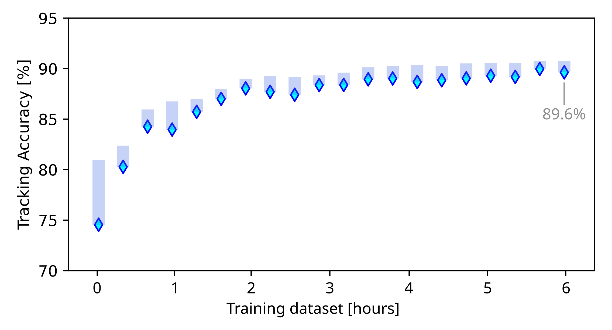

 <a href="https://fertmeneses.github.io/" target="_blank"> Go to Home Page </a> 

# Machine Learning and Quantum Diamond Magnetometry applied to Object Monitoring

My flagship project as a research fellow at The University of Melbourne combined **Machine Learning (ML)** architectures with experimental **Quantum Sensing** to solve a real-life problem: **monitoring the position of an object using magnetic fields**. 

Magnetic sensing offers a compelling alternative to traditional tracking systems like Global Positioning System (GPS). It is especially valuable in GPS-denied environments such as **indoor spaces, underground or underwater**, because **magnetic signals can propagate in these scenarios**. Another key advantage is that **magnetic tracking does not require the target to be equipped with a receiver**, which broadens the range of potential applications.

The **major challenge for magnetic sensing** lies in **analyzing and interpreting the data**. Usually, magnetic information has a complex signature convoluted with environmental noise, requiring sophiticated physical models and calculations to extract meaningful positional information. **In this project, we solve this problem by developing a Machine Learning algorithm capable of predicting the position of an object directly from magnetic measurements**.

<figure>
   
  <figcaption>Quantum diamond sensing and machine learning applied to object monitoring.</figcaption>
</figure>

## Quantum Sensing Technology

Our **sensing platform** is based on **nitrogen-vacancy (NV) defects** in a **diamond** sample, which exploits quantum properties to detect magnetic field variations with sub-nanotesla (nT) sensitivity. For this project, we **tracked an elevator traveling up to 8 floors, a representative example of an indoor environment where GPS signals are denied**. The elevator generates **magnetic field variations in the order of few hundreds of nT**, well within the sensitivity range of our device. Just to give a reference to the reader, the Earth's magnetic field is about 50,000 nT!

The **quantum diamond magnetometer** works by exciting NV defects with a **green laser**, pushing the electrons to high energy levels. As these electrons naturally decay into low energy levels, we employ a **photodetector** to read the **light emmited in that quantum process**. Additionally, we can **manipulate the quantum system by using microwaves** and set the electrons into **"bright" or "dark" energy levels**, which have different light emission intensities. As the energy difference between these dark and bright levels depend on the **external magnetic field**, we can use protocols that detect variations in the light emission and precisely identify the external magnetic field.

<figure>
   
  <figcaption>Quantum diamond magnetometer: setup description.</figcaption>
</figure>

## Machine Learning Architecture

**How do we correlate the elevator's position $Z$ with the magnetic signal $\vec{B}$?** As the elevator moves, the magnetic field changes in the three spatial directions X,Y,Z, and we measure these signals as $(B_X,B_Y,B_Z)$. Then, our goal is to **build a ML algorithm that receives the input signal $(B_X,B_Y,B_Z)$ and predicts the $Z$ position of the elevator**. 

Given that **magnetic measurements are noisy and fluctuate over time**, we don't rely on a single measurement $(B_X,B_Y,B_Z)$ to determine the position $Z$. Instead, we use the **magnetic information from the latest few seconds**, namely a time window $\Delta t$, to predict a single position. Although this approach might resemble a forecasting problem, we are **not trying to predict the elevator's schedule nor the users' behavior**, but rather **correlate the elevator's position with the magnetic field, for any travelling scheme**!

Our ML architecture is inspired in **computer vision techniques, applied to one-dimensional (1D) timeseries** rather than 2D images. As shown in the image below, **we use three sequences as the input data** (you can think of them as the RGB colors in a 2D image), one for each magnetic field component $B_X$, $B_Y, $B_Z$. The ML algorithm uses a **set of convolutional layers**, correlating close data points (in time) and extracting features, which are then passed to **fully connected layers**, finally producing a **single output: the Z position of the elevator**. As the whole process is really fast (less than 1 ms), the ML algorithm can predict position after position as we measure the magnetic fields with a frequency of 0.1 seconds, working as a **real-time object monitoring application**.

<figure>
   
  <figcaption>Machine learning architecture.</figcaption>
</figure>

## Training the ML algorithm with experimental data

Since our goal for the monitoring application is to rely exclusively on experimental data, without the need of developing any physical models nor simulations, **the ML algorithm must be trained with experimental data**. For this purpose, **we recorded the magnetic signal and the elevator position over 6 hours for the training dataset, and another 6 hours for the testing dataset**.

In our project, **we explored several ML architecture and tuning strategies**, testing various hyperparameters and also making major decisions, for example **deciding if the input information should include all magnetic components $(B_X,B_Y,B_Z)$ or just one or two, and optimizing the duration of the time window**. We also assessed **how much we can reduce the training dataset** while keeping a minimum performance.

<figure>
   
  <figcaption>Optimization process: accuracy vs. size of the training dataset.</figcaption>
</figure>

In each optimization step, we evaluated the ML performance using an **accuracy metric**, evaluating how many predictions were correct in the entire dataset. For this purpose, **we computed a prediction as correct if the predicted position was within 1-meter tolerance from the actual value**. Since the **distance between floors is 4 meters**, this tolerance is sufficient to reliably determine the closest level for the elevator at any time.

## Object Monitoring in Action: Sensing + ML performance

After the training process, we ended up with a **ML model that reached approximately 90% accuracy in the training dataset**. When we evaluated this ML model in the **testing dataset**, we obtained a very similar result, meaning that, in average, **9 out of 10 points were correctly predicted every second within a 1-meter tolerance**. And looking closer, we observed that the main source of errors were predictions around Levels 3 and 4, which were confused with each other. From a physical point of view, we believe that at these positions the elevator cage and counterweight are very close to each other and the magnetic signals become very similar.

<figure>
   
  <figcaption>Machine learning predictions for new data.</figcaption>
</figure>

Finally, we evaluated the ML performance across a range of tolerances, showing that **the position precision can be improved down to 30 cm, while keeping the accuracy above 80%**. On the other hand, **if the tolerance increases up to 2 meters, which is the limit for distinguishing adjacent floors, then the accuracy goes up to 95%**. 

## Perspectives

By integrating **quantum sensing** with **Machine Learning**, we developed a sensing platform capable of tracking an object moving across 8 building levels (spaced every 4 meters), achieving an **accuracy around 90%* within a 1-meter tolerance**. As our algorithm is trained **exclusively on experimental data**, it can be **easily adapted to many scenarios** such as underground mines or tunnels, where magnetic signal can propagate but GPS technology cannot be applied, **without the need of complex physical modelling or simulations**. Moreover, the **accuracy-tolerance tradeoff can be customized for each specific application**, offering flexible performance depending on the required precision.

## Further information

📖👉 [Read the full scientific article in arXiv.](https://arxiv.org/abs/2502.14683)

🎥👉 [Watch the virtual lecture on YouTube.](https://www.youtube.com/watch?v=5ZBcUqQFWfI)

💻👉 [Explore the GitHub repository including code and datasets.](https://github.com/Fertmeneses/ML_QDM_Meneses_et_al)

<figure>
   
</figure>

-----

[🔼 Back to top](#machine-learning-and-quantum-diamond-magnetometry-applied-to-object-monitoring)

 <a href="https://fertmeneses.github.io/" target="_blank"> Go to Home Page </a> 

